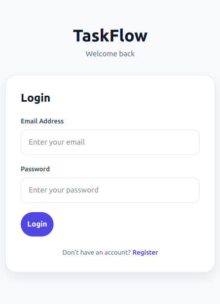
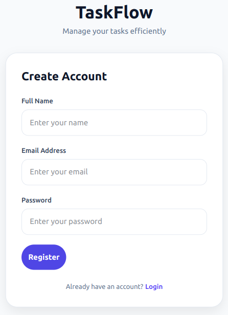
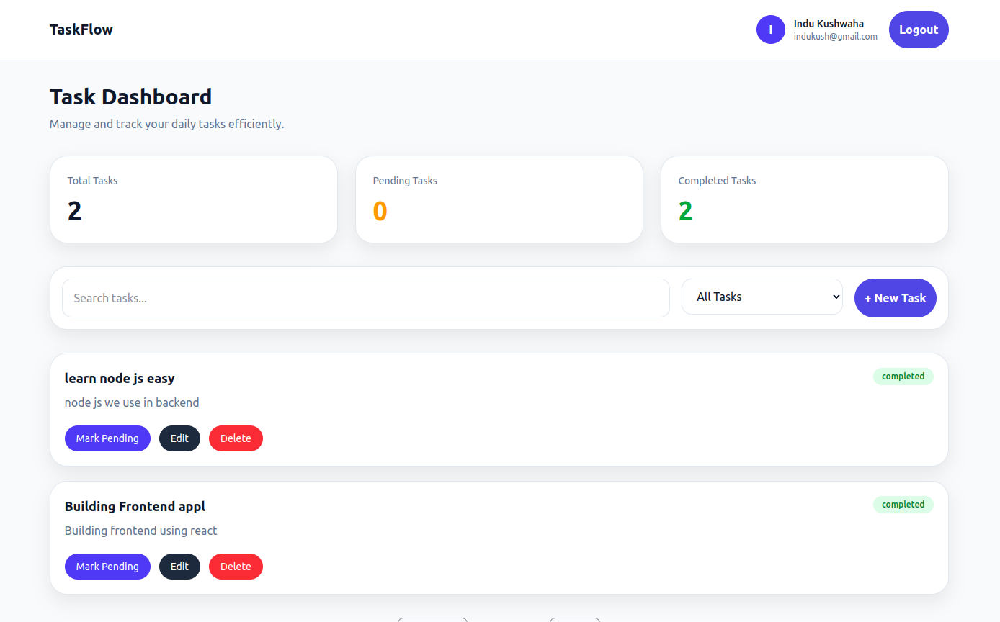
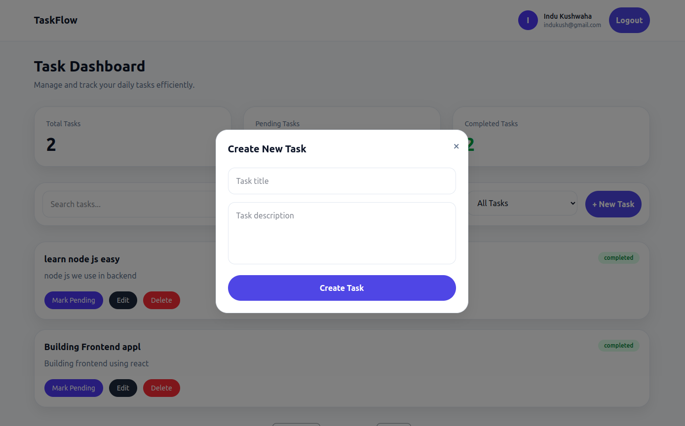
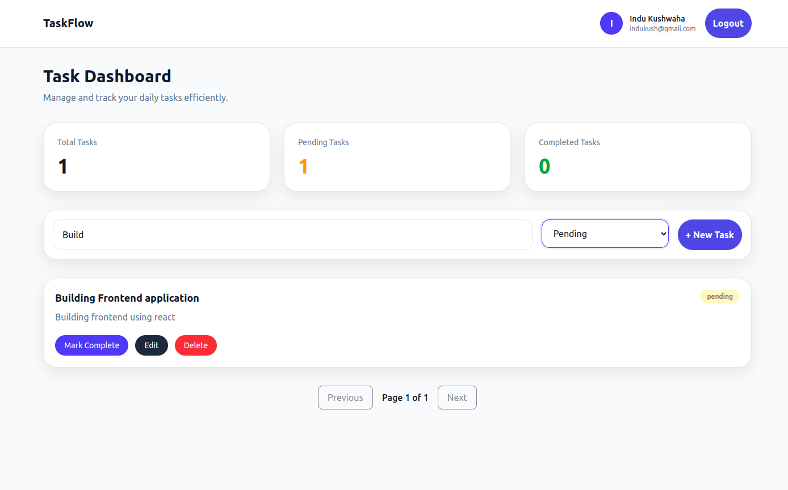
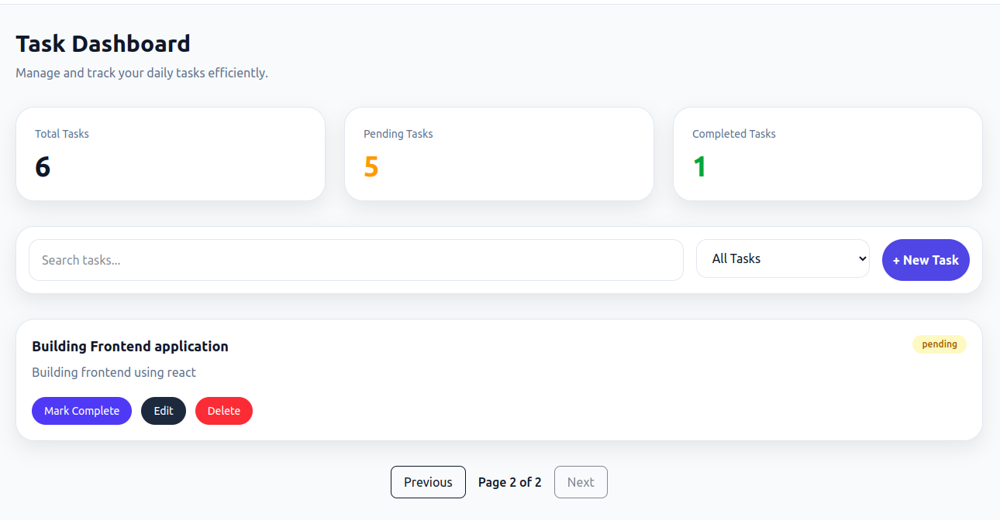

# Task Management Application

## Project Overview

A full-stack task management application built using React.js, Node.js, Express.js and MongoDB.

Users can register, login, create tasks, update tasks, delete tasks, search tasks, filter tasks and manage task status.

## Tech Stack

### Frontend

- React.js
- Redux Toolkit
- Redux Thunk
- React Router DOM
- Tailwind CSS
- React Hook Form
- React Toastify

### Backend

- Node.js
- Express.js
- MongoDB
- Mongoose
- JWT Authentication

## Features

- User Registration
- User Login
- JWT Authentication
- Protected Routes
- Create Task
- Update Task
- Delete Task
- Toggle Task Status
- Search Tasks
- Filter Tasks
- Pagination
- Responsive UI
- Toast Notifications

## Installation

### Frontend

```bash
npm install
npm run dev

## Screenshots

### Login Page



### Register Page



### Dashboard



### Create Task



### Search & Filter



### Pagination


```
